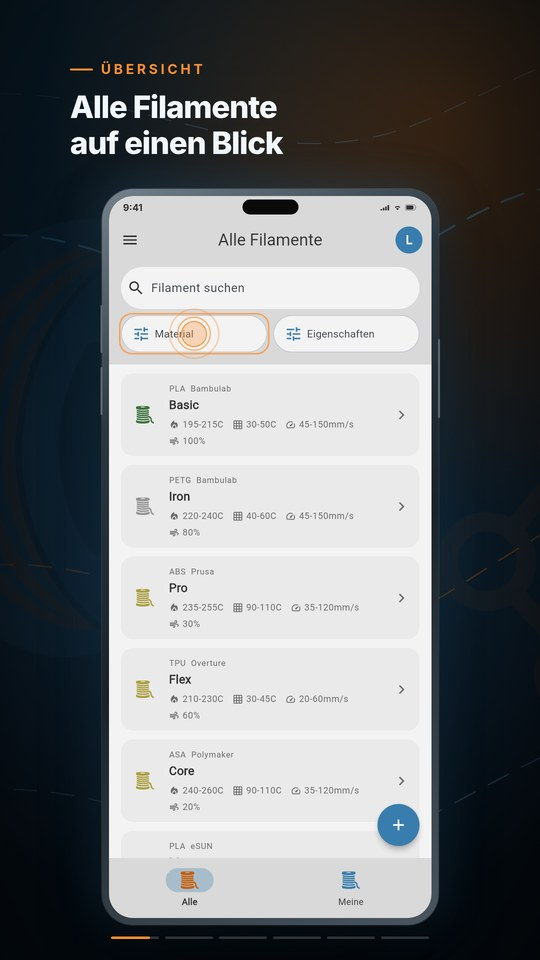

# App-Vorschau — Produktvideos

Diese Videos zeigen Filament Nexus im Einsatz und dienen als Vorzeigematerial
der App: für den App-Store-Eintrag, Präsentationen und alle, die sich in unter
einer Minute ein Bild von der App machen wollen.

## Die drei Fassungen

| Datei | Auflösung | Länge | Verwendung |
|---|---|---|---|
| [filament-nexus-appstore-886x1920.mp4](filament-nexus-appstore-886x1920.mp4) | 886 × 1920 | 29.1 s | **App Store Connect** (App-Preview, iPhone 6.5"/6.7"/6.9") |
| [filament-nexus-appstore-1080x1920.mp4](filament-nexus-appstore-1080x1920.mp4) | 1080 × 1920 | 29.1 s | Gleicher Schnitt in Master-Auflösung — Google Play, Präsentationen |
| [filament-nexus-extended-1080x1920.mp4](filament-nexus-extended-1080x1920.mp4) | 1080 × 1920 | 43.9 s | Längere Fassung — Website, Social Media, Demos |

Alle Fassungen: 30 fps, H.264, ohne Ton (Apple erlaubt stumme App-Previews).
Der Store-Schnitt bleibt bewusst unter Apples Limit von 30 Sekunden; die
längere Fassung lässt jeden Screen ruhiger stehen und zeigt dieselbe Tour.

## Was gezeigt wird

Die Tour führt in sechs Kapiteln durch die App — jeder Screen ist eine echte
Aufnahme der App, jeder Fingertipp sitzt auf dem Element, das beim Aufnehmen
tatsächlich geklickt wurde:

1. **Übersicht** — Liste aller Filamente
2. **Suchen & filtern** — Materialfilter öffnen, PLA wählen, anwenden
3. **Datenblatt** — Detailansicht mit Temperaturen, Eigenschaften und Bewertungen
4. **Deine Sammlung** — Wechsel zu «Meine Filamente»
5. **Erfassen** — Formular mit Allgemein-, Details- und Bewertungs-Tab
6. **Wiki** — bebilderte Wissensliste, Eintrag «Stringing» wird geöffnet

## Herkunft und Aktualisierung

Die Videos werden mit [Remotion](https://remotion.dev) aus echten
App-Screenshots gebaut. Die Produktion (Capture-Pipeline, Storyboard,
Render-Setup) liegt im separaten Projekt `appstore-video` neben diesem Repo im
Workbench-Ordner — dort beschreibt das README den gesamten Ablauf.

Kurzfassung: Ein Skript klickt die App (mit lokalen Mock-Daten statt Firebase)
per Semantik-Baum real durch, verifiziert jeden Klick, nimmt jeden Zustand
pixelgenau auf und Remotion setzt daraus die Tour zusammen. Nach sichtbaren
Änderungen an der App genügt dort `pnpm capture` gefolgt von den drei
Render-Befehlen, um alle Fassungen zu aktualisieren — die Dateien hier im
Ordner sind das jeweils aktuelle Ergebnis.
